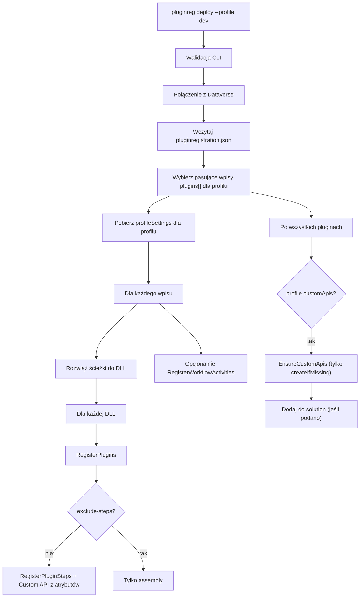

# Deploy — rejestracja pluginów i Custom API w Dataverse

Ten dokument opisuje, **co dokładnie dzieje się** podczas wywołania `pluginreg deploy`. Jest to najbardziej złożona operacja narzędzia.

**Kluczowe fakty:**
- `deploy` **wgrywa** zawartość DLL(i) do Dataverse jako `pluginassembly`.
- **Nie kompiluje** kodu — operuje wyłącznie na już zbudowanych artefaktach (zazwyczaj `bin/Release/*.dll`).
- Używa **reflection-only** ładowania (`MetadataLoadContext`) — kod pluginu nie jest wykonywany.
- Rejestruje/zaktualizuje `plugintype`, `sdkmessageprocessingstep`, obrazy, secure config i Custom API.
- Obsługuje **profile środowisk** (`dev`, `test`, `prod`) przez `pluginregistration.json`.
- Opcjonalnie dodaje wszystkie komponenty do solution (`--solution` lub wpis w JSON).

---

## Przegląd przepływu



---

## Krok 1 — Uruchomienie i walidacja CLI

W `Program.cs`:

```bash
pluginreg deploy --path ./MyPlugins --profile dev --connection "..." --exclude-steps --workflow
```

Walidatory (`CommandValidators.AddDeployValidators`):

- Katalog musi istnieć.
- Musi istnieć `pluginregistration.json` w tym katalogu (w przeciwnym razie sugestia uruchomienia `init`).
- `--profile` jest **wymagany**.
- Połączenie: albo `--connection`, albo komplet zmiennych środowiskowych (`DATAVERSE_URL` / `POWERPLATFORM_*` + ClientId + ClientSecret + TenantId).

Jeśli walidacja przejdzie, tworzony jest `IOrganizationService` (`ServiceClient`) i wywoływane:

```csharp
var deployService = new PluginDeployService(service, trace);
deployService.Deploy(workingDirectory, profile, excludeSteps, workflow);
```

---

## Krok 2 — Wczytanie konfiguracji

`PluginRegistrationConfig.Load()`:

1. Odczytuje `{workingDirectory}/pluginregistration.json`.
2. Deserializuje do `Plugins` (lista `PluginDeployEntry`) i `Profiles` (słownik `ProfileSettings`).

**Wybór wpisów dla profilu** (`GetPluginEntries`):

- Szuka wpisów, których pole `profile` zawiera nazwę profilu (lub jest puste i profil to "default").
- Pole `profile` w JSON może być listą oddzieloną przecinkami: `"dev,test,prod"`.

**Ustawienia profilu** (`GetProfileSettings`):

- Zwraca `profiles.<profile>` lub `null`.

---

## Krok 3 — Rozwiązywanie ścieżek do assembly

Dla każdego wybranego `PluginDeployEntry`:

```csharp
config.ResolveAssemblyPaths(entry)
```

Logika:
- Jeśli `assemblyPath` nie ma rozszerzenia → dodaje `*.dll`.
- Szuka plików w `Path.Combine(workingDir, katalogZPatternu)`.
- Zwraca posortowaną listę pełnych ścieżek do DLL.

Przykład w JSON:

```json
"assemblyPath": "bin/Release"
```

→ faktycznie szuka `bin/Release/*.dll` względem katalogu z `pluginregistration.json`.

---

## Krok 4 — Rejestracja assembly (`RegisterPlugins`)

Dla każdej DLL wykonywane jest `PluginRegistrationService.RegisterPlugins(assemblyPath, skipSteps)`.

### 4.1 Filtrowanie

Pomija pliki zaczynające się od `System.` oraz znane biblioteki SDK (lista w `ReflectionHelper.IgnoredAssemblies`).

### 4.2 Reflection-only load

```csharp
using var context = ReflectionHelper.CreateLoadContext(directory);
var assembly = context.LoadFromAssemblyPath(...);
```

Kontekst zawiera runtime .NET + wszystkie DLL z katalogu wyjściowego. Nie wykonuje kodu.

### 4.3 Wykrywanie pluginów

Szuka klas:
- `IsClass && !IsAbstract`
- implementujących interfejs o nazwie `IPlugin`

Jeśli nie znajdzie żadnych — pomija plik.

### 4.4 Rejestracja assembly w Dataverse (`RegisterAssembly`)

1. Bierze **pierwszy** atrybut `[CrmPluginRegistration]` spośród wszystkich typów w assembly (tylko po to, żeby odczytać `IsolationMode`).
2. Pobiera istniejące `pluginassembly` po **nazwie** assembly (`GetPluginAssemblyByName`).
3. Zawsze czyta **całą zawartość** pliku DLL i konwertuje do Base64 (`content`).
4. Buduje/updatuje rekord:
   - `name`, `culture`, `version`, `publickeytoken`
   - `sourcetype = 0` (Database)
   - `isolationmode = 2` (Sandbox) lub `1` (None) — z atrybutu
5. **Create** lub **Update**.
6. Po update: `RemoveOrphanedPluginTypes` (patrz niżej).
7. Jeśli podano `solution` → `AddSolutionComponent` (componentType=91, `addRequiredComponents=true`).

**Uwaga:** nawet przy `--exclude-steps` assembly jest wgrywane.

### 4.5 Czyszczenie osieroconych typów (`RemoveOrphanedPluginTypes`)

Gdy assembly jest **aktualizowane**:

- Pobiera wszystkie istniejące `plugintype` dla tego assembly.
- Porównuje z typami obecnymi w aktualnie ładowanym assembly.
- Dla każdego typu, którego już nie ma w DLL:
  - Usuwa wszystkie kroki (`sdkmessageprocessingstep`) tego typu.
  - Usuwa sam `plugintype`.

To jest mechanizm czyszczenia po refaktoringu/usunięciu klasy pluginu.

---

## Krok 5 — Rejestracja kroków (`RegisterPluginSteps`)

Tylko gdy `!excludePluginSteps`.

Dla każdego typu pluginu (`IPlugin`):

1. `UpsertPluginType` — tworzy lub aktualizuje `plugintype` (kluczem jest `typename = FullName`).
2. Pobiera istniejące kroki dla tego `plugintype`.
3. Dla każdego `[CrmPluginRegistration]` na klasie:
   - Jeśli to **Custom API** (patrz niżej) → osobna ścieżka.
   - W przeciwnym razie:
     - `PluginStepNameResolver.ApplyStepName` — jeśli `Name` nie jest podane, generuje `{FullName}.{Stage}` (np. `Sample.Plugins.AccountCreatePlugin.PreOperation`).
     - `EnvironmentConfigurationResolver.ApplyProfileOverrides(attribute)` — patrz niżej.
     - `RegisterStep(...)`.
4. Po przetworzeniu wszystkich atrybutów: usuwa pozostałe kroki z listy `existingSteps` (tylko etapy 10, 20, 40, 50).

### 5.1 RegisterStep — dopasowanie istniejącego kroku

Kolejność szukania istniejącego kroku:

1. Jeśli atrybut ma `Id` (GUID) → szuka po `sdkmessageprocessingstepid`.
2. W przeciwnym razie szuka po parze:
   - `name` (po ApplyStepName)
   - **nazwa wiadomości** SDK (`sdkmessage.name`)

Jeśli nie znajdzie — tworzy nowy.

### 5.2 Rozwiązywanie message + filter

- Gdy `EntityLogicalName == "none"` (lub ignorowane wielkość liter):
  - Tylko `sdkmessage` po nazwie wiadomości (np. akcje globalne).
- W przeciwnym razie:
  - Szuka `sdkmessagefilter` po `primaryobjecttypecode` + powiązanej wiadomości.
  - Jeśli nie znajdzie filtra → ostrzeżenie i pominięcie kroku.

### 5.3 Tworzenie/aktualizacja rekordu kroku

Ustawiane pola:
- `name`, `configuration` (unsecure), `description`
- `mode` (0=sync, 1=async)
- `asyncautodelete`
- `rank` (ExecutionOrder)
- `stage`
- `supporteddeployment` (na podstawie `Server` + `Offline`)
- `plugintypeid`, `sdkmessageid`, `sdkmessagefilterid` (opcjonalnie)
- `filteringattributes` (znormalizowane, bez spacji)

Po zapisie kroku:
- `RegisterSecureConfiguration`
- `RegisterImages`
- Jeśli solution → `AddSolutionComponent` (typ 92)

### 5.4 Secure Configuration

Osobny rekord `sdkmessageprocessingstepsecureconfig` powiązany ze stepem.

- Jeśli w finalnym atrybucie `SecureConfiguration` jest puste → usuwa istniejący rekord (jeśli był).
- W przeciwnym razie tworzy lub aktualizuje.

**Uwaga:** secure config **nie jest** wersjonowana w atrybutach (bezpieczeństwo).

### 5.5 Obrazy kroków

`PluginStepImageReader.GetImages(type, stepAttribute)`:

- Szuka wszystkich `[CrmPluginStepImage]` na klasie.
- Dopasowuje po `Stage` + opcjonalnie `Message` (gdy klasa ma wiele stepów na tym samym stage).
- Dla każdego obrazu tworzy/aktualizuje `sdkmessageprocessingstepimage`.
- Po wszystkim usuwa obrazy, które nie zostały obsłużone (obsoletne).

Pola obrazu:
- `name` / `entityalias`
- `imagetype`
- `attributes`
- `messagepropertyname` (automatycznie: `Id` dla Create, `Target` dla większości, specjalne dla Send/SetState itp.)

---

## Krok 6 — Custom API z atrybutów w kodzie

Podczas `RegisterPluginSteps`, jeśli atrybut spełnia:

```csharp
Name is null && Message is not null && Stage is null
```

to wywoływane jest `RegisterCustomApi`.

`CustomApiAttributeReader.Read(...)` czyta z klasy:
- `[CrmPluginRegistration("unique_name", ...)]`
- Wszystkie `[CrmCustomApiRequestParameter(...)]` i `[CrmCustomApiResponseProperty(...)]` (z filtrem `ApiUniqueName` gdy klasa ma wiele API).

Następnie `CustomApiRegistrationService.RegisterCustomApi(model, pluginTypeId)` (patrz niżej).

---

## Krok 7 — Custom API z profilu JSON (`EnsureCustomApis`)

Po przetworzeniu wszystkich wpisów pluginów:

```csharp
if (profileSettings?.CustomApis.Count > 0)
{
    customApiService.EnsureCustomApis(
        profileSettings.CustomApis.Where(d => d.CreateIfMissing));
}
```

Dla każdej definicji z `createIfMissing: true`:

1. Szuka `plugintype` po `pluginTypeName`.
2. Jeśli nie istnieje i `createIfMissing` — błąd (musi być najpierw zarejestrowany typ).
3. W przeciwnym razie wywołuje `RegisterCustomApi(FromProfileDefinition(...), pluginTypeId)`.

Różnica względem atrybutów:
- Definicja pochodzi w 100% z `pluginregistration.json` (może nadpisać `displayName`, `pluginTypeName` itp.).
- `createIfMissing` kontroluje czy dany profil w ogóle próbuje tworzyć API.

---

## Krok 8 — Szczegóły obsługi Custom API (`CustomApiRegistrationService`)

### RegisterCustomApi

1. Pobiera istniejące `customapi` + parametry + odpowiedzi po `uniquename`.
2. Jeśli nie istnieje → `CreateCustomApiTree`.
3. Jeśli istnieje:
   - `RequiresRecreate` → usuwa całe drzewo + tworzy od nowa.
   - W przeciwnym razie → `UpdateCustomApi` + sync parametrów i odpowiedzi.

**Co powoduje pełny recreate (`RequiresRecreate`):**
- zmiana `bindingtype`
- zmiana `isfunction`
- zmiana `boundentitylogicalname`
- zmiana `type` lub `logicalentityname` dowolnego parametru/odpowiedzi
- zmiana `isoptional` (dla request parameters)

Te pola są "immutable" po utworzeniu Custom API.

### Create / Update / Sync

- Tworzy `customapi`, potem osobno `customapirequestparameter` i `customapiresponseproperty`.
- Przy sync:
  - usuwa te, których nie ma w modelu
  - tworzy nowe
  - aktualizuje istniejące (tylko displayname/description/isoptional)
- Po każdej operacji (tworzenie Custom API + parametry) dodaje komponenty do solution (jeśli podano):
  - 372 = CustomApi
  - 371 = CustomApiRequestParameter
  - 373 = CustomApiResponseProperty

`EnsureCustomApis` używa ostatniego solution z przetworzonych wpisów `plugins[]`.

---

## Krok 9 — Profile overrides i zmienne środowiskowe

`EnvironmentConfigurationResolver` stosowany jest **przed** zapisem stepu:

1. Szuka `stepOverrides` w profilu:
   - najpierw po `Id` (GUID z atrybutu)
   - potem po `Name` (wygenerowanej lub jawnej)
2. Jeśli znajdzie `StepOverride`:
   - nadpisuje `UnSecureConfiguration`, `SecureConfiguration`, `Description` (tylko jeśli wartość w JSON nie jest `null`).
3. Na końcu (zawsze) rozwija wzorce `${NAZWA_ZMIENNEJ}` używając `Environment.GetEnvironmentVariable`.
   - Jeśli zmienna nie istnieje — wyjątek.

Przykład w JSON:

```json
"stepOverrides": {
  "Sample.Plugins.AccountCreatePlugin.PreOperation": {
    "unSecureConfiguration": "${MY_PLUGIN_CONFIG}"
  }
}
```

Podobny mechanizm działa dla definicji Custom API z profilu (`GetCustomApiOverride`).

---

## Krok 10 — Workflow Activities (`--workflow`)

Osobna ścieżka wywoływana tylko gdy `--workflow`:

- `GetWorkflowActivityTypes` — klasy dziedziczące (po nazwie) od `CodeActivity`.
- `RegisterAssembly` (z flagą `isWorkflowActivity`).
- `RegisterWorkflowActivityTypes`:
  - Tworzy/aktualizuje `plugintype` z polami `name`, `friendlyname`, `description`, `workflowactivitygroupname`, `isworkflowactivity`.
  - Nie rejestruje kroków (workflow activity to inny mechanizm).

Atrybut używany do workflow:

```csharp
[CrmPluginRegistration("Name", "Friendly", "Desc", "Group", IsolationModeEnum.Sandbox)]
```

---

## Krok 11 — Dodawanie do solution

Za każdym razem gdy `SolutionUniqueName` jest ustawione (z wpisu `plugins[].solution`):

- `AddSolutionComponent` (Execute `AddSolutionComponent` request).
- Dla assembly: `addRequiredComponents: true`.
- Dla stepów i Custom API: domyślnie `false` (z wyjątkiem głównego Custom API).

Rozwiązanie jest pobierane z pierwszego/pierwszych wpisów; dla Custom API z profilu — z ostatniego.

---

## Podsumowanie tego, co jest tworzone/aktualizowane/usuwane

| Element Dataverse                    | Tworzony/aktualizowany gdy...                  | Usuwany gdy... |
|--------------------------------------|------------------------------------------------|---------------|
| `pluginassembly`                     | Zawsze (dla każdej pasującej DLL)              | Nigdy bezpośrednio |
| `plugintype` (plugin)                | Dla każdej klasy `IPlugin` z atrybutem         | Przy orphaned types + przy recreate Custom API |
| `sdkmessageprocessingstep`           | Dla każdego `[CrmPluginRegistration]` step     | Obsolete steps (po atrybutach), orphaned |
| `sdkmessageprocessingstepimage`      | Dla każdego pasującego `[CrmPluginStepImage]`  | Obsolete images |
| `sdkmessageprocessingstepsecureconfig` | Gdy `SecureConfiguration` niepuste            | Gdy secure config jest puste w finalnym atrybucie |
| `customapi`                          | Z atrybutu lub z profilu (`createIfMissing`)   | Przy `RequiresRecreate` |
| `customapirequestparameter`          | Z atrybutów lub profilu                        | Przy sync (brak w modelu) lub recreate |
| `customapiresponseproperty`          | Analogicznie                                   | Analogicznie |
| Solution components                  | Gdy podano `solution`                          | Nie (AddSolutionComponent nie usuwa) |

---

## Ważne zachowania i pułapki

1. **Brak transakcji** — operacje są wykonywane sekwencyjnie. Częściowa rejestracja jest możliwa przy błędzie w środku.

2. **Dopasowanie kroków** opiera się na nazwie kroku + nazwie wiadomości. Zmiana nazwy kroku w kodzie bez `Id` spowoduje utworzenie nowego kroku (stary zostanie usunięty jako obsolete).

3. **Id w atrybucie** (`Id = "guid"`) pozwala na stabilne aktualizowanie tego samego rekordu kroku niezależnie od nazwy.

4. **Custom API recreate** jest destrukcyjny — usuwa stare parametry i odpowiedzi.

5. **createIfMissing** w profilu działa **tylko** dla wpisów z `createIfMissing: true`. Domyślnie po `init` tylko pierwszy profil ma `true`.

6. **Zmienne środowiskowe** są wymagane — brak `${VAR}` rzuca wyjątek w trakcie deployu.

7. **Profile "default"** — specjalna obsługa gdy nie podasz `--profile` lub użyjesz wartości `default`.

8. **Kolejność** w `plugins[]` ma znaczenie przy wyborze solution dla Custom API z profilu (bierze `entries.LastOrDefault()`).

9. **DLL musi być zbudowane** przed deployem — narzędzie nie wywołuje `dotnet build`.

10. **Reflection load** nie widzi typów spoza kontekstu — upewnij się, że wszystkie zależności DLL są obok lub w katalogu.

---

## Typowy pełny przebieg

```bash
dotnet build -c Release
pluginreg deploy --path samples/Sample.Plugins --profile dev
```

Co się stanie:

1. Połączenie.
2. Wczytanie JSON → wpis dla "dev", solution=SampleSolution.
3. Znalezienie `bin/Release/*.dll`.
4. Dla `Sample.Plugins.dll`:
   - Wgranie assembly (create/update).
   - Dla `AccountCreatePlugin` → upsert plugintype + step PreOperation + obrazy (jeśli są).
   - Dla `ProcessAccountCustomApiPlugin` → rejestracja Custom API + parametry z atrybutów.
5. Po pluginach → EnsureCustomApis (dla dev ma createIfMissing).
6. Dodanie wszystkich komponentów do `SampleSolution`.

---

## Relacja z innymi komendami

| Komenda | Kierunek | Co robi w kontekście deploy |
|---------|----------|-----------------------------|
| `init`  | — | Tworzy szkielet `pluginregistration.json` |
| `sync`  | Dataverse → kod | Nadpisuje atrybuty na podstawie aktualnego stanu (odwrotność części deploy) |
| `deploy` | kod + JSON → Dataverse | Jedyna komenda, która wgrywa DLL i tworzy metadane rejestracji |

---

## W skrócie

`deploy` to **pełny pipeline rejestracji**:

- ładuje konfigurację per-profil,
- reflektuje zbudowane DLL-e,
- wgrywa assembly,
- tworzy/aktualizuje typy pluginów,
- zakłada lub aktualizuje stepy + obrazy + secure config (z nadpisaniami z profilu i zmiennych env),
- obsługuje Custom API zarówno z atrybutów jak i z JSON,
- czyści to, co zniknęło z kodu,
- opcjonalnie dodaje wszystko do solution.

Działa deterministycznie na podstawie atrybutów w kodzie + `pluginregistration.json` + stanu w Dataverse.