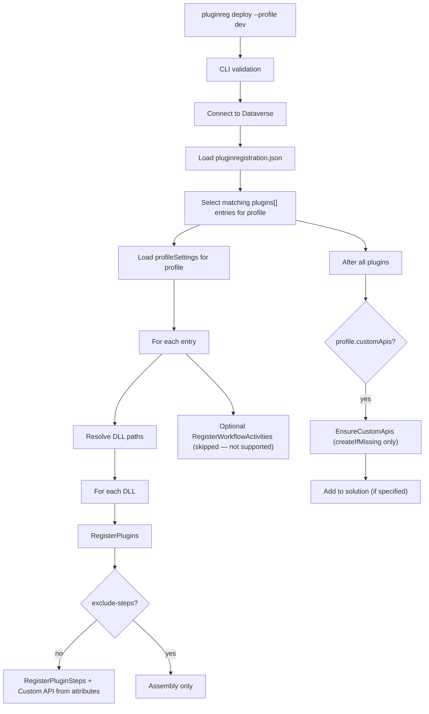

# Deploy — registering plugins and Custom APIs in Dataverse

This document describes **exactly what happens** when you run `pluginreg deploy`. It is the most complex operation in the tool.

CLI reference: [cli.md](cli.md). Configuration: [configuration.md](configuration.md). Getting started: [getting-started.md](getting-started.md).

**Key facts:**
- `deploy` **uploads** DLL content to Dataverse as `pluginassembly`.
- It **does not compile** code — it only works on already-built artifacts (typically `bin/Release/*.dll`).
- Uses **reflection-only** loading (`MetadataLoadContext`) — plugin code is never executed.
- Registers/updates `plugintype`, `sdkmessageprocessingstep`, images, secure config, and Custom API.
- Supports **environment profiles** (`dev`, `test`, `prod`) via `pluginregistration.json`.
- Optionally adds all components to a solution (`--solution` or an entry in JSON).

---

## Flow overview



---

## Step 1 — CLI invocation and validation

In `Program.cs`:

```bash
pluginreg deploy --path ./MyPlugins --profile dev --connection "..." --exclude-steps --workflow
```

Validators (`CommandValidators.AddDeployValidators`):

- The directory must exist.
- `pluginregistration.json` must exist in that directory (otherwise you are prompted to run `init`).
- `--profile` is **required**.
- Connection: either `--connection` or a full set of environment variables (`DATAVERSE_URL` / `POWERPLATFORM_*` + ClientId + ClientSecret + TenantId).

If validation passes, an `IOrganizationService` (`ServiceClient`) is created and:

```csharp
var deployService = new PluginDeployService(service, trace);
deployService.Deploy(workingDirectory, profile, excludeSteps, workflow);
```

---

## Step 2 — Loading configuration

`PluginRegistrationConfig.Load()`:

1. Reads `{workingDirectory}/pluginregistration.json`.
2. Deserializes into `Plugins` (list of `PluginDeployEntry`) and `Profiles` (dictionary of `ProfileSettings`).

**Selecting entries for a profile** (`GetPluginEntries`):

- Finds entries whose `profile` field contains the profile name (or is empty and the profile is "default").
- The `profile` field in JSON can be a comma-separated list: `"dev,test,prod"`.

**Profile settings** (`GetProfileSettings`):

- Returns `profiles.<profile>` or `null`.

---

## Step 3 — Resolving assembly paths

For each selected `PluginDeployEntry`:

```csharp
config.ResolveAssemblyPaths(entry)
```

Logic:
- If `assemblyPath` has no extension → appends `*.dll`.
- Searches files under `Path.Combine(workingDir, patternDirectory)`.
- Returns a sorted list of full paths to DLLs.

Example in JSON:

```json
"assemblyPath": "bin/Release"
```

→ effectively searches `bin/Release/*.dll` relative to the directory containing `pluginregistration.json`.

---

## Step 4 — Assembly registration (`RegisterPlugins`)

For each DLL, `PluginRegistrationService.RegisterPlugins(assemblyPath, skipSteps)` runs.

### 4.1 Filtering

Skips files starting with `System.` and known SDK libraries (list in `ReflectionHelper.IgnoredAssemblies`).

### 4.2 Reflection-only load

```csharp
using var context = ReflectionHelper.CreateLoadContext(directory);
var assembly = context.LoadFromAssemblyPath(...);
```

The context includes the .NET runtime plus all DLLs from the output directory. Code is not executed.

### 4.3 Plugin detection

Finds classes that are:
- `IsClass && !IsAbstract`
- implementing an interface named `IPlugin`

If none are found — the file is skipped.

### 4.4 Registering assembly in Dataverse (`RegisterAssembly`)

1. Checks whether the assembly has any `[PluginRegistration]` or `[CustomApiRegistration]` attributes on its types.
2. Uses the first `[PluginRegistration]` attribute (if any) to read `IsolationMode`.
3. Fetches existing `pluginassembly` by **name** (`GetPluginAssemblyByName`).
4. Always reads the **entire** DLL file and converts it to Base64 (`content`).
5. Builds/updates the record:
   - `name`, `culture`, `version`, `publickeytoken`
   - `sourcetype = 0` (Database)
   - `isolationmode = 2` (Sandbox) or `1` (None) — from the attribute when present
6. **Create** or **Update**.
7. After update: `RemoveOrphanedPluginTypes` (see below).
8. If `solution` is set → `AddSolutionComponent` (componentType=91, `addRequiredComponents=true`).

**Note:** even with `--exclude-steps`, the assembly is still uploaded.

### 4.5 Cleaning orphaned types (`RemoveOrphanedPluginTypes`)

When the assembly is **updated**:

- Fetches all existing `plugintype` records for that assembly.
- Compares them with types present in the currently loaded assembly.
- For each type no longer in the DLL:
  - Deletes all steps (`sdkmessageprocessingstep`) for that type.
  - Deletes the `plugintype` itself.

This cleans up after refactoring or removing a plugin class.

---

## Step 5 — Step registration (`RegisterPluginSteps`)

Only when `!excludePluginSteps`.

For each plugin type (`IPlugin`):

1. `UpsertPluginType` — creates or updates `plugintype` (key: `typename = FullName`).
2. Fetches existing steps for that `plugintype`.
3. For each `[PluginRegistration]` on the class:
   - `PluginStepNameResolver.ApplyStepName` — if `Name` is not set, generates `{FullName}.{Stage}` (e.g. `Sample.Plugins.AccountCreatePlugin.PreOperation`).
   - `EnvironmentConfigurationResolver.ApplyProfileOverrides(attribute)` — see below.
   - `RegisterStep(...)`.
4. For each `[CustomApiRegistration]` on the class:
   - `RegisterCustomApi(...)` via `CustomApiRegistrationService`.
5. After processing all attributes: deletes remaining steps from `existingSteps` (only stages 10, 20, 40, 50).

### 5.1 RegisterStep — matching an existing step

Order of lookup for an existing step:

1. If the attribute has `Id` (GUID) → search by `sdkmessageprocessingstepid`.
2. Otherwise search by:
   - `name` (after ApplyStepName)
   - **SDK message name** (`sdkmessage.name`)

If not found — a new step is created.

### 5.2 Resolving message + filter

- When `EntityLogicalName == "none"` (case-insensitive):
  - Uses `sdkmessage` by message name only (e.g. global actions).
- Otherwise:
  - Looks up `sdkmessagefilter` by `primaryobjecttypecode` + related message.
  - If no filter is found → warning and the step is skipped.

### 5.3 Creating/updating the step record

Fields set:
- `name`, `configuration` (unsecure)
- `mode` (0=sync, 1=async)
- `asyncautodelete`
- `rank` (ExecutionOrder)
- `stage`
- `supporteddeployment` (based on `Server`)
- `plugintypeid`, `sdkmessageid`, `sdkmessagefilterid` (optional)
- `filteringattributes` (normalized, no spaces)

After saving the step:
- `RegisterSecureConfiguration`
- `RegisterImages`
- If solution → `AddSolutionComponent` (type 92)

### 5.4 Secure configuration

Separate `sdkmessageprocessingstepsecureconfig` record linked to the step.

- If final `SecureConfiguration` is empty → deletes existing record (if any).
- Otherwise creates or updates.

**Note:** secure config is **not** stored in attributes (security).

### 5.5 Step images

`PluginStepImageReader.GetImages(type, stepAttribute)`:

- Finds all `[PluginStepImage]` attributes on the class.
- Matches by `ImageType` and step `Stage` (PreImage → pre-stages, PostImage → PostOperation).
- For each image creates/updates `sdkmessageprocessingstepimage`.
- Afterwards deletes images that were not handled (obsolete).

Image fields:
- `name` / `entityalias`
- `imagetype`
- `attributes`
- `messagepropertyname` (automatic: `Id` for Create, `Target` for most, special cases for Send/SetState, etc.)

---

## Step 6 — Custom API from code attributes

During `RegisterPluginSteps`, for each `[CustomApiRegistration]` on the class:

`CustomApiAttributeReader.Read(...)` reads from the class:
- `[CustomApiRegistration(...)]`
- All `[CustomApiRequestParameter(...)]` and `[CustomApiResponseProperty(...)]` (filtered by `ApiUniqueName` when the class has multiple APIs).

Then `CustomApiRegistrationService.RegisterCustomApi(model, pluginTypeId)` (see below).

---

## Step 7 — Custom API from profile JSON (`EnsureCustomApis`)

After processing all plugin entries:

```csharp
if (profileSettings?.CustomApis.Count > 0)
{
    customApiService.EnsureCustomApis(
        profileSettings.CustomApis.Where(d => d.CreateIfMissing));
}
```

For each definition with `createIfMissing: true`:

1. Looks up `plugintype` by `pluginTypeName`.
2. If it does not exist and `createIfMissing` — error (the type must be registered first).
3. Otherwise calls `RegisterCustomApi(FromProfileDefinition(...), pluginTypeId)`.

Difference from attributes:
- Definition comes 100% from `pluginregistration.json` (can override `displayName`, `pluginTypeName`, etc.).
- `createIfMissing` controls whether this profile attempts to create the API.

---

## Step 8 — Custom API handling details (`CustomApiRegistrationService`)

### RegisterCustomApi

1. Fetches existing `customapi` + parameters + response properties by `uniquename`.
2. If it does not exist → `CreateCustomApiTree`.
3. If it exists:
   - `RequiresRecreate` → deletes the entire tree and recreates.
   - Otherwise → `UpdateCustomApi` + sync parameters and response properties.

**What triggers full recreate (`RequiresRecreate`):**
- change of `bindingtype`
- change of `isfunction`
- change of `boundentitylogicalname`
- change of `type` or `logicalentityname` on any parameter/response property
- change of `isoptional` (for request parameters)

These fields are immutable after Custom API creation.

### Create / Update / Sync

- Creates `customapi`, then `customapirequestparameter` and `customapiresponseproperty` separately.
- On sync:
  - deletes those not in the model
  - creates new ones
  - updates existing (displayname/description/isoptional only)
- After each operation (Custom API + parameters) adds components to the solution (if specified):
  - 372 = CustomApi
  - 371 = CustomApiRequestParameter
  - 373 = CustomApiResponseProperty

`EnsureCustomApis` uses the last solution from processed `plugins[]` entries.

---

## Step 9 — Profile overrides and environment variables

`EnvironmentConfigurationResolver` is applied **before** saving a step:

1. Looks up `stepOverrides` in the profile:
   - first by `Id` (GUID from the attribute)
   - then by `Name` (generated or explicit)
2. If a `StepOverride` is found:
   - overrides `UnSecureConfiguration` and `SecureConfiguration` (only when the JSON value is not `null`).
3. Finally (always) expands `${VARIABLE_NAME}` patterns using `Environment.GetEnvironmentVariable`.
   - If the variable is missing — throws an exception.

Example in JSON:

```json
"stepOverrides": {
  "Sample.Plugins.AccountCreatePlugin.PreOperation": {
    "unSecureConfiguration": "${MY_PLUGIN_CONFIG}"
  }
}
```

A similar mechanism applies to Custom API definitions from the profile (`GetCustomApiOverride`).

---

## Step 10 — Workflow activities (`--workflow`)

When `--workflow` is passed, the tool attempts workflow registration, but **workflow activity attributes are no longer supported** in the current attribute model. The operation logs a message and does not register workflow metadata from attributes.

---

## Step 11 — Adding to solution

Whenever `SolutionUniqueName` is set (from `plugins[].solution`):

- `AddSolutionComponent` (Execute `AddSolutionComponent` request).
- For assembly: `addRequiredComponents: true`.
- For steps and Custom API: default `false` (except the main Custom API record).

The solution name comes from plugin entries; for profile Custom APIs — from the last entry.

---

## Summary of what is created/updated/deleted

| Dataverse entity                     | Created/updated when...                          | Deleted when... |
|--------------------------------------|--------------------------------------------------|-----------------|
| `pluginassembly`                     | Always (for each matching DLL)                   | Never directly |
| `plugintype` (plugin)                | For each `IPlugin` class with attributes         | Orphaned types + Custom API recreate |
| `sdkmessageprocessingstep`           | For each `[PluginRegistration]` step           | Obsolete steps (after attributes), orphaned |
| `sdkmessageprocessingstepimage`      | For each matching `[PluginStepImage]`            | Obsolete images |
| `sdkmessageprocessingstepsecureconfig` | When `SecureConfiguration` is non-empty        | When secure config is empty in final attribute |
| `customapi`                          | From attribute or profile (`createIfMissing`)    | On `RequiresRecreate` |
| `customapirequestparameter`          | From attributes or profile                       | On sync (missing from model) or recreate |
| `customapiresponseproperty`          | Same as above                                    | Same |
| Solution components                  | When `solution` is specified                     | No (AddSolutionComponent does not remove) |

---

## Important behavior and pitfalls

1. **No transactions** — operations run sequentially. Partial registration is possible if an error occurs mid-run.

2. **Step matching** relies on step name + message name. Changing the step name in code without `Id` creates a new step (the old one is deleted as obsolete).

3. **`Id` on the attribute** (`Id = "guid"`) enables stable updates of the same step record regardless of name.

4. **Custom API recreate** is destructive — it deletes old parameters and response properties.

5. **`createIfMissing` in the profile** applies **only** to entries with `createIfMissing: true`. By default after `init`, only the first profile has `true`.

6. **Environment variables** are required — a missing `${VAR}` throws during deploy.

7. **"default" profile** — special handling when `--profile` is omitted or set to `default`.

8. **Order** in `plugins[]` matters when choosing the solution for profile Custom APIs (uses `entries.LastOrDefault()`).

9. **DLL must be built** before deploy — the tool does not run `dotnet build`.

10. **Reflection load** does not see types outside the context — ensure all DLL dependencies are alongside or in the directory.

---

## Typical full run

```bash
dotnet build -c Release
pluginreg deploy --path samples/Sample.Plugins --profile dev
```

What happens:

1. Connect.
2. Load JSON → entry for "dev", solution=SampleSolution.
3. Find `bin/Release/*.dll`.
4. For `Sample.Plugins.dll`:
   - Upload assembly (create/update).
   - For `AccountCreatePlugin` → upsert plugintype + step + images (if any).
   - For `ProcessAccountCustomApiPlugin` → register Custom API + parameters from attributes.
5. After plugins → EnsureCustomApis (for dev with createIfMissing).
6. Add all components to `SampleSolution`.

---

## Relationship with other commands

| Command | Direction | Role relative to deploy |
|---------|-----------|-------------------------|
| `init`  | — | Creates `pluginregistration.json` scaffold |
| `sync`  | Dataverse → code | Overwrites attributes from current state (partial inverse of deploy) |
| `deploy` | code + JSON → Dataverse | Only command that uploads DLL and creates registration metadata |

---

## In short

`deploy` is the **full registration pipeline**:

- loads per-profile configuration,
- reflects over built DLLs,
- uploads the assembly,
- creates/updates plugin types,
- creates or updates steps + images + secure config (with profile and env overrides),
- handles Custom API from both attributes and JSON,
- cleans up what disappeared from code,
- optionally adds everything to a solution.

It runs deterministically based on attributes in code + `pluginregistration.json` + state in Dataverse.