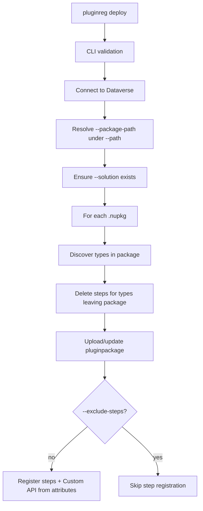

# Deploy — registering plugins and Custom APIs in Dataverse

This document describes **exactly what happens** when you run `pluginreg deploy`.

CLI reference: [cli.md](cli.md). Getting started: [getting-started.md](getting-started.md).

**Key facts:**
- `deploy` **uploads** plugin NuGet packages (`.nupkg`) to Dataverse as `pluginpackage` (not raw `.dll`).
- It **does not compile** code — pack first (`dotnet pack -c Release`).
- Uses **reflection-only** loading (`MetadataLoadContext`) on assemblies inside the package — plugin code is never executed.
- Registers/updates `sdkmessageprocessingstep`, images, and Custom API against package-managed assemblies.
- Optionally adds components to a solution (`--solution`); missing unmanaged solutions are created automatically.
- **No** `pluginregistration.json` — package path and solution are CLI options.

---

## Flow overview


```mermaid
flowchart TD
    A["pluginreg deploy"] --> B["CLI validation"]
    B --> C["Connect to Dataverse"]
    C --> D["Resolve --package-path under --path"]
    D --> E["Ensure --solution exists"]
    E --> F["For each .nupkg"]
    F --> G["Discover types in package"]
    G --> H["Delete steps for types leaving package"]
    H --> I["Upload/update pluginpackage"]
    I --> J{"--exclude-steps?"}
    J -->|no| K["Register steps + Custom API from attributes"]
    J -->|yes| L["Skip step registration"]
```

---

## CLI

```bash
pluginreg deploy \
  --path ./MyPlugins \
  --package-path bin/Release \
  --solution SampleSolution
```

| Option | Description |
|--------|-------------|
| `--path` / `-p` | Working directory (default: current) |
| `--package-path` | Folder or `*.nupkg` pattern relative to `--path` (default: `bin/Release`) |
| `--solution` / `-s` | Solution unique name (optional) |
| `--exclude-steps` | Package upload only |
| `--connection` / `-c` | Connection string or use `DATAVERSE_*` |

---

## Package path resolution

`--package-path` is resolved under `--path`:

| Value | Behavior |
|-------|----------|
| `bin/Release` | Search `bin/Release/**/*.nupkg` |
| `bin/Release/*.nupkg` | Same folder, explicit pattern |
| absolute path | Search under that directory |

Symbol packages (`.snupkg`) are ignored.

---

## Solution and publisher prefix

When `--solution` is set:

1. Ensures the solution exists (creates unmanaged with default publisher if missing).
2. Uses that solution's publisher **customization prefix** for:
   - `pluginpackage` name/uniquename on **create**: `{prefix}_{NuGetPackageId}`
   - Custom API `uniquename`: `{prefix}_{name}` unless already prefixed

---

## Registration pipeline (per package)

1. Upsert `pluginpackage` content from the full `.nupkg`.
2. Wait for Dataverse-created `pluginassembly` / `plugintype` rows.
3. Remove dependencies (steps, Custom APIs) for types no longer in the package **before** content update when needed.
4. Unless `--exclude-steps`: register steps and Custom APIs from attributes against server plugintype ids.
5. Add steps/Custom APIs to the solution when `--solution` is set (`AddRequiredComponents=false`).

Custom APIs and plugin steps are defined **only in code attributes** — not in JSON.

See also: [plugin-steps.md](plugin-steps.md), [custom-api.md](custom-api.md), [troubleshooting.md](troubleshooting.md).

---

## Typical full run

```bash
dotnet pack -c Release
pluginreg deploy --path samples/Sample.Plugins --package-path bin/Release --solution SampleSolution
```

---

## In short

`deploy` uploads `.nupkg` packages, reflects attributes from package assemblies, registers steps and Custom APIs in Dataverse, and optionally associates them with a solution — all driven by CLI arguments and code attributes.
