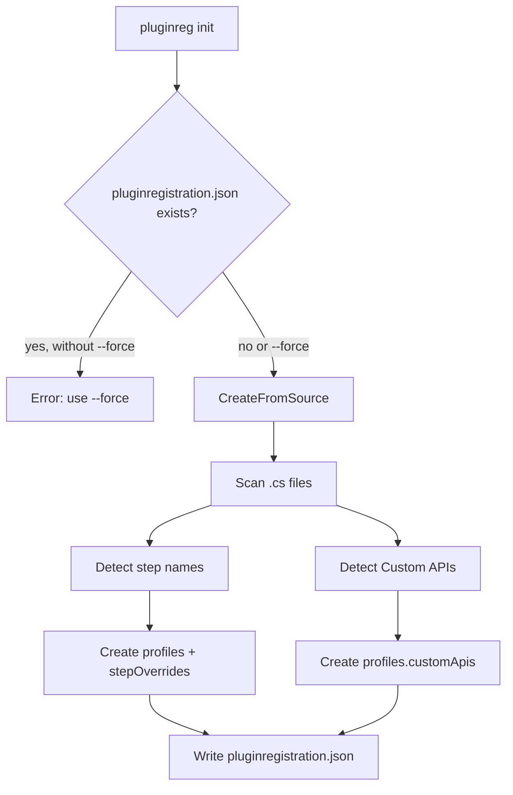

# Init — generating `pluginregistration.json`

This document describes how the `pluginreg init` command works: from CLI invocation to the deploy configuration file.

CLI reference: [cli.md](cli.md). Configuration format: [configuration.md](configuration.md). Getting started: [getting-started.md](getting-started.md).

**Important:** `init` **does not connect to Dataverse** and **does not modify source code**. It only creates `pluginregistration.json` in the working directory.

---

## Flow overview



---

## Step 1 — CLI invocation

The `init` command in `Program.cs` calls `ConfigScaffoldService.Generate()`.

```bash
pluginreg init --path samples/Sample.Plugins --profiles dev,test,prod --assembly-path bin/Release --solution SampleSolution
```

| Parameter | Default | Description |
|-----------|---------|-------------|
| `--path`, `-p` | current directory | Plugin project directory |
| `--profiles` | `dev,test,prod` | Comma-separated list of profiles |
| `--assembly-path` | `bin/Release` | DLL path written to `plugins[].assemblyPath` |
| `--solution` | — | Solution name added to the deploy entry |
| `--force` | `false` | Overwrites existing `pluginregistration.json` |

---

## Step 2 — Output file validation

`ConfigScaffoldService.Generate()` checks whether `pluginregistration.json` already exists.

- File exists and **no** `--force` → exception with a message to use `--force`.
- Otherwise generation continues.

---

## Step 3 — Generation from source code

`init` always scans `.cs` source files in the given directory (`CreateFromSource`).

---

## Step 4 — Scanning source files

`EnumerateSourceFiles()` recursively searches the `--path` directory:

- includes `*.cs` files;
- skips `obj/` and `bin/` directories.

For each file, text content is read (regex-based, no compilation).

---

## Step 5 — Detecting step names

`DiscoverStepNames()` looks for `[PluginRegistration(...)]` blocks associated with a plugin class.

For each match:

1. Extracts `StageEnum` from the attribute.
2. Extracts the class name from the `class` declaration.
3. Combines with `namespace` from the file.
4. Generates the step name: `{namespace}.{class}.{Stage}` via `PluginStepNameResolver`.

Example: `Sample.Plugins.AccountCreatePlugin.PreOperation`.

**Note:** `init` does not read DLLs or Dataverse — it only detects what is already written in attributes in code. If attributes are missing, `stepOverrides` will be empty.

---

## Step 6 — Detecting Custom APIs

`DiscoverCustomApis()` looks for `[CustomApiRegistration(...)]` on plugin classes:

```csharp
[CustomApiRegistration("api_unique_name")]
public class MyPlugin : IPlugin
```

For each API it records:

- `uniqueName` — from the attribute;
- `displayName` — from `DisplayName` / `FriendlyName`, or defaults to `uniqueName`;
- `pluginTypeName` — full class name (`namespace.class`).

Duplicate `uniqueName` values are deduplicated.

---

## Step 7 — Building the JSON structure

### `plugins` section

One deploy entry for all profiles:

```json
{
  "profile": "dev,test,prod",
  "assemblyPath": "bin/Release",
  "solution": "SampleSolution"
}
```

Values come from CLI parameters.

### `profiles` section

For **each** profile from `--profiles`, a `ProfileSettings` object is created:

#### `stepOverrides`

For each detected step name:

```json
"Sample.Plugins.AccountCreatePlugin.PreOperation": {
  "unSecureConfiguration": ""
}
```

Empty `unSecureConfiguration` is a placeholder — fill it manually or via `${ENV_VAR}` before deploy.

#### `customApis`

For each detected Custom API:

```json
{
  "uniqueName": "sample_ProcessAccount",
  "displayName": "sample_ProcessAccount",
  "pluginTypeName": "Sample.Plugins.ProcessAccountCustomApiPlugin",
  "createIfMissing": true,
  "bindingType": 0
}
```

`createIfMissing: true` is set **only for the first profile** in `--profiles`. Other profiles get `false`.

---

## Step 8 — Serialization and save

Configuration is serialized to JSON (camelCase, null values omitted) and saved as:

```
{workingDirectory}/pluginregistration.json
```

The tool logs the path of the created file.

---

## Example usage

```bash
# First run in a new project
pluginreg init --path samples/Sample.Plugins

# With custom profiles and solution
pluginreg init \
  --path samples/Sample.Plugins \
  --profiles dev,test,prod \
  --assembly-path bin/Release \
  --solution SampleSolution

# Overwrite an existing file
pluginreg init --path samples/Sample.Plugins --force
```

---

## Relationship `init` → `deploy`

| Element | `init` | `deploy` |
|---------|--------|----------|
| `plugins[].assemblyPath` | writes | uses to find DLLs |
| `plugins[].solution` | writes | adds components to solution |
| `profiles.*.stepOverrides` | creates scaffold | overrides step config per environment |
| `profiles.*.customApis` | registers detected APIs | `createIfMissing` creates API from JSON |

Typical workflow:

```bash
pluginreg init --path ./MyPlugins
# fill in stepOverrides in pluginregistration.json
dotnet build -c Release
pluginreg deploy --path ./MyPlugins --profile dev
```

---

## Limitations

- **Without attributes in code**, `init` will not generate `stepOverrides` or `customApis`.
- **Does not validate** Dataverse connection — use `whoami` / `deploy` for that.
- **Regex, not compiler** — detection relies on text patterns in `.cs` files; unusual attribute formatting may not be recognized.
- **Does not generate attributes** — use `sync` to pull metadata from Dataverse into code (see [sync.md](sync.md)).

---

## In short

`init` is a **deploy configuration scaffold generator**: it creates `pluginregistration.json` with environment profiles, `stepOverrides` keys, and Custom API entries based on existing attributes in code.