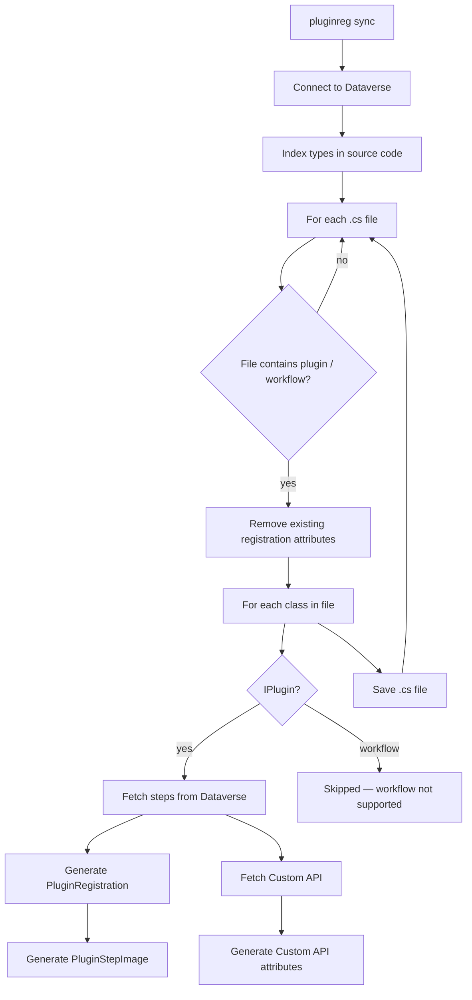

# Sync — synchronizing metadata into source code

This document describes how the `pluginreg sync` command works: from connecting to Dataverse to writing registration attributes in `.cs` files.

CLI options and examples: [cli.md](cli.md). Getting started: [getting-started.md](getting-started.md).

## Separate tool and plugin repositories

The tool and plugin code **can live in different folders**. Point `sync` at the plugin source tree:

```bash
dotnet run --project /path/to/PluginRegistrationTool/src/PluginRegistration.Tool -- \
  sync --path /path/to/MyCrmPlugins/src/MyCompany.Plugins
```

Requirements:

1. Plugin classes in `.cs` files (including `BasePlugin : IPlugin` inheritance chains)
2. Types **already registered** in the connected Dataverse environment
3. `namespace.class` in code must equal `plugintype.typename`

`sync` does **not** require `pluginregistration.json`.

After sync, optionally run `init` in the plugin project to scaffold deploy configuration.

---

**Important:** `sync` is the **inverse of `deploy`** for attributes:

- **does not upload** DLLs to Dataverse;
- **does not create** or update `pluginregistration.json`;
- **overwrites** `[PluginRegistration]`, `[CustomApiRegistration]`, `[PluginStepImage]`, `[CustomApiRequestParameter]`, and `[CustomApiResponseProperty]` in code based on the current environment state.

Use it to update attributes in code from Dataverse.

---

## Flow overview



---

## Step 1 — CLI invocation

The `sync` command in `Program.cs` connects to Dataverse and calls `MetadataSyncService.SyncSourceCode()`.

```bash
pluginreg sync --path samples/Sample.Plugins
```

| Parameter | Description |
|-----------|-------------|
| `--path`, `-p` | Directory with plugin source code (default: current directory) |
| `--connection`, `-c` | Connection string; otherwise `DATAVERSE_*` variables |
| `--class-regex` | Custom class detection regex (when inheritance analysis is insufficient) |

**Note:** `--profile` is not used by `sync` — the operation reads the current state from the connected Dataverse environment.

---

## Step 2 — Connecting to Dataverse

Same as `deploy`: `Connect()` creates `IOrganizationService`. All queries for steps, images, and Custom API go to **one** connected environment.

Verify the environment before `sync`:

```bash
pluginreg whoami --connection "..."
```

---

## Step 3 — Indexing types in source code

When `--class-regex` is **not** provided, a `SourceCodeTypeIndex` is built:

1. Scans all `.cs` files (excluding `obj/`, `bin/`).
2. Parses class declarations and inheritance relationships.
3. Recognizes plugin types — directly `IPlugin` / `PluginBase` / `Plugin`, or indirectly via a base class.
4. Recognizes workflow — `CodeActivity` / `WorkFlowActivityBase` or indirectly.

This lets `sync` handle `class MyPlugin : BasePlugin` where `BasePlugin : IPlugin`.

With `--class-regex`, the legacy regex-only `CodeParser` is used (no cross-file inheritance analysis).

---

## Step 4 — Iterating source files

`SyncSourceCode()` enumerates `*.cs` under `--path` and for each file:

- skips files without plugin/workflow classes (when using the index);
- creates a `CodeParser` with types assigned to that file.

---

## Step 5 — Removing old attributes

`CodeParser.RemoveExistingAttributes()` removes from the file (regex) all of:

- `[PluginRegistration(...)]` and legacy `[CrmPluginRegistration(...)]`
- `[CustomApiRegistration(...)]`
- `[PluginStepImage(...)]` and legacy `[CrmPluginStepImage(...)]`
- `[CustomApiRequestParameter(...)]` and legacy `[CrmCustomApiRequestParameter(...)]`
- `[CustomApiResponseProperty(...)]` and legacy `[CrmCustomApiResponseProperty(...)]`

**Effect:** every `sync` **replaces** previous registration attributes — it does not merge with manual edits. Keep a backup or commit before running on important code.

---

## Step 6 — Plugins (`IPlugin`)

For each plugin class in the file, `AddPluginAttributes(parser, className)` runs.

### 6.1 Fetching steps from Dataverse

`DataverseQueries.GetPluginStepsForTypeName(className)` — finds `sdkmessageprocessingstep` linked to `plugintype.typename` = full class name.

Validation: duplicate step names in Dataverse cause an exception.

### 6.2 Skipping internal Custom API steps

Steps with `stage = 30` (`CustomApiInternalStage`) are skipped — internal Custom API step, not declared in plugin code.

### 6.3 Mapping a step to an attribute

For each step, Dataverse fields are read and a `PluginRegistrationAttribute` is built via `CreateStep`:

| Dataverse field | Attribute property |
|-----------------|-------------------|
| `sdkmessageid` → name | `Message` (as `MessageTypeEnum`) |
| `sdkmessagefilterid` → entity or `"none"` | `EntityLogicalName` |
| `stage` | `StageEnum` |
| `mode` | `ExecutionModeEnum` |
| `filteringattributes` | `FilteringAttributes` (`string[]`) |
| `rank` | `ExecutionOrder` |
| `configuration` | `UnSecureConfiguration` |
| `asyncautodelete` | `DeleteAsyncOperation` |
| `sdkmessageprocessingstepid` | `Id` |

If the step name in Dataverse differs from the default `{class}.{Stage}`, a named property `Name = "..."` is generated.

The attribute is inserted before the class declaration via `AttributeCodeGenerator`.

**Note:** messages not in `MessageTypeEnum` cannot be synced — add them to the enum first.

### 6.4 Step images

`ReadStepImages(stepId)` fetches `sdkmessageprocessingstepimage` and generates separate `[PluginStepImage]` attributes:

- `Name`, `ImageType`, `Attributes` (constructor: name, image type, attribute list).

Generator: `PluginStepImageCodeGenerator`.

### 6.5 Custom API linked to the type

`GetCustomApisForPluginType(className)` returns Custom API definitions with parameters and response properties.

For each API it generates:

- `[CustomApiRegistration(...)]` with metadata (DisplayName, BindingType, IsFunction, etc.);
- `[CustomApiRequestParameter(...)]`;
- `[CustomApiResponseProperty(...)]`.

When a class has **more than one** Custom API, parameters get `ApiUniqueName` in the generated code.

Generator: `CustomApiCodeGenerator`.

---

## Step 7 — Workflow activities

Workflow classes (`CodeActivity` and derivatives) are detected but **workflow registration attributes are not generated** — the current attribute model does not support workflow activity registration.

---

## Step 8 — Saving the file

`CodeParser.Save()` writes the modified content with the file's **original encoding** (UTF-8 with BOM, etc.).

The tool logs each updated file and a summary count.

---

## Example usage

```bash
# Sync from default directory (connection via DATAVERSE_*)
pluginreg sync --path samples/Sample.Plugins

# Sync with explicit connection string
pluginreg sync --path ./MyPlugins --connection "AuthType=ClientSecret;..."

# Sync with custom class regex (edge case)
pluginreg sync --path ./MyPlugins --class-regex "public class (?'class'\\w+)[\\W]*: MyPluginBase"
```

---

## Example effect in code

Before `sync` (no attributes or outdated):

```csharp
public sealed class AccountCreatePlugin : IPlugin
{
    public void Execute(IServiceProvider serviceProvider) { }
}
```

After `sync` (metadata from Dataverse):

```csharp
[PluginRegistration(MessageTypeEnum.Create, "account", StageEnum.PreOperation, ExecutionModeEnum.Synchronous, ["name"], 1)]
public sealed class AccountCreatePlugin : IPlugin
{
    public void Execute(IServiceProvider serviceProvider) { }
}
```

With multiple filtering attributes the generator may emit an array:

```csharp
new[] { "name", "accountnumber" }
```

Custom API example:

```csharp
[CustomApiRegistration("sample_ProcessAccount", FriendlyName = "Process Account")]
[CustomApiRequestParameter("AccountId", CustomApiParameterTypeEnum.String, IsRequired = true)]
[CustomApiResponseProperty("Success", CustomApiParameterTypeEnum.Boolean)]
public sealed class ProcessAccountCustomApiPlugin : IPlugin { ... }
```

---

## Relationship `sync` ↔ `deploy`

| Aspect | `sync` | `deploy` |
|--------|--------|----------|
| Data direction | Dataverse → code | code + DLL → Dataverse |
| Requires DLL | no | yes |
| Requires `pluginregistration.json` | no | yes |
| Modifies `.cs` | yes | no |
| Profile `stepOverrides` | not applied | applied on deploy |
| Removes old attributes in code | yes | — |

Typical scenarios:

1. **Plugin registered manually in Plugin Registration Tool** → `sync` to add attributes to the repo.
2. **New environment, same code** → `deploy` (not `sync`).
3. **Changes in Dataverse (e.g. new Custom API parameter)** → `sync` to update code, then commit.

---

## Limitations and risks

- **Overwrites attributes** — manual edits to registration attributes are lost on the next `sync`.
- **Requires registered type** — the class must already exist as `plugintype` in Dataverse (after a prior `deploy` or manual registration).
- **Full type name** — step matching uses `namespace.class`; changing namespace in code without updating Dataverse causes no match.
- **Secure configuration** — `sync` does not recreate secure config in attributes (it stays in Dataverse; deploy manages a separate record).
- **One environment at a time** — output depends on which Dataverse you are connected to.
- **MessageTypeEnum only** — uncommon SDK messages must be added to `MessageTypeEnum` before they can be synced.

---

## In short

`sync` **updates attributes in source code**: it pulls step, image, and Custom API definitions from Dataverse for registered plugin types and writes them as C# attributes ready for the next `deploy` and version control.