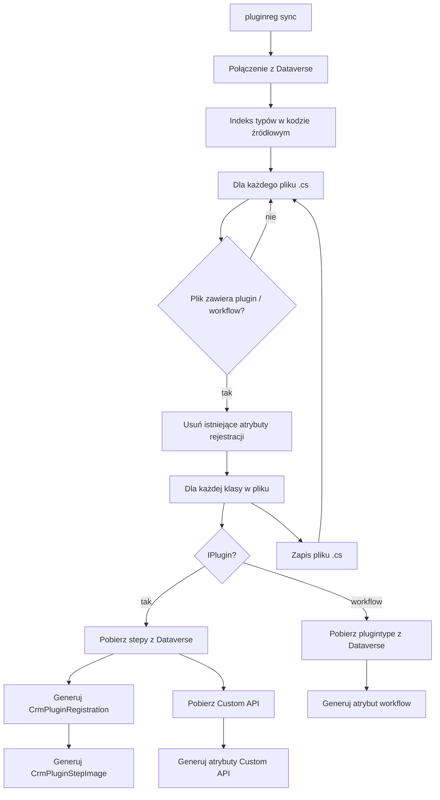

# Sync — synchronizacja metadanych do kodu źródłowego

Ten dokument opisuje, jak działa komenda `pluginreg sync`: od połączenia z Dataverse do zapisania atrybutów rejestracji w plikach `.cs`.

**Ważne:** `sync` to operacja **odwrotna do `deploy`** w zakresie atrybutów:

- **nie wgrywa** DLL do Dataverse;
- **nie tworzy** ani nie aktualizuje `pluginregistration.json`;
- **nadpisuje** atrybuty `[CrmPluginRegistration]`, `[CrmPluginStepImage]`, `[CrmCustomApiRequestParameter]` i `[CrmCustomApiResponseProperty]` w kodzie na podstawie aktualnego stanu w środowisku.

Służy do aktualizacji atrybutów w kodzie na podstawie stanu w Dataverse.

---

## Przegląd przepływu



---

## Krok 1 — Uruchomienie CLI

Komenda `sync` w `Program.cs` tworzy połączenie z Dataverse i wywołuje `MetadataSyncService.SyncSourceCode()`.

```bash
pluginreg sync --path samples/Sample.Plugins
```

| Parametr | Opis |
|----------|------|
| `--path`, `-p` | Katalog z kodem źródłowym pluginów (domyślnie bieżący katalog) |
| `--connection`, `-c` | Connection string; bez niego zmienne `DATAVERSE_*` |
| `--class-regex` | Własny regex wykrywania klas (gdy analiza dziedziczenia nie wystarcza) |

**Uwaga:** `--profile` nie jest używany przez `sync` — operacja czyta aktualny stan z połączonego środowiska Dataverse.

---

## Krok 2 — Połączenie z Dataverse

Identycznie jak przy `deploy`: `Connect()` tworzy `IOrganizationService`. Wszystkie zapytania o stepy, obrazy i Custom API idą do **jednego** połączonego środowiska.

Przed `sync` warto zweryfikować środowisko:

```bash
pluginreg whoami --connection "..."
```

---

## Krok 3 — Indeksowanie typów w kodzie

Gdy **nie** podano `--class-regex`, budowany jest `SourceCodeTypeIndex`:

1. Skanuje wszystkie pliki `.cs` (bez `obj/`, `bin/`).
2. Parsuje deklaracje klas i relacje dziedziczenia.
3. Rozpoznaje typy pluginów — bezpośrednio `IPlugin` / `PluginBase` / `Plugin` lub pośrednio przez klasę bazową.
4. Rozpoznaje workflow — `CodeActivity` / `WorkFlowActivityBase` lub pośrednio.

Dzięki temu `sync` obsługuje scenariusz `class MyPlugin : BasePlugin`, gdzie `BasePlugin : IPlugin`.

Przy `--class-regex` używany jest starszy `CodeParser` oparty wyłącznie na regex (bez analizy dziedziczenia między plikami).

---

## Krok 4 — Iteracja po plikach źródłowych

`SyncSourceCode()` enumeruje `*.cs` w `--path` i dla każdego pliku:

- pomija pliki bez klas plugin/workflow (gdy używany jest indeks);
- tworzy `CodeParser` z listą typów przypisanych do tego pliku.

---

## Krok 5 — Usunięcie starych atrybutów

`CodeParser.RemoveExistingAttributes()` usuwa z pliku (regex) wszystkie:

- `[CrmPluginRegistration(...)]`
- `[CrmPluginStepImage(...)]`
- `[CrmCustomApiRequestParameter(...)]`
- `[CrmCustomApiResponseProperty(...)]`

**Efekt:** każdy `sync` **zastępuje** poprzednie atrybuty rejestracji — nie scala ich z ręcznymi zmianami. Zachowaj kopię lub commit przed uruchomieniem na ważnym kodzie.

---

## Krok 6 — Pluginy (`IPlugin`)

Dla każdej klasy pluginu w pliku wywoływane jest `AddPluginAttributes(parser, className)`.

### 6.1 Pobranie stepów z Dataverse

`DataverseQueries.GetPluginStepsForTypeName(className)` — wyszukuje `sdkmessageprocessingstep` powiązane z `plugintype.typename` = pełna nazwa klasy.

Walidacja: duplikaty nazw stepów w Dataverse powodują wyjątek.

### 6.2 Pominięcie stepów wewnętrznych Custom API

Stepy ze `stage = 30` (`CustomApiInternalStage`) są pomijane — to wewnętrzny krok Custom API, nie deklarowany w kodzie pluginu.

### 6.3 Mapowanie stepu na atrybut

Dla każdego stepu odczytywane są pola Dataverse i budowany `CrmPluginRegistrationAttribute`:

| Pole Dataverse | Właściwość atrybutu |
|----------------|---------------------|
| `sdkmessageid` → nazwa | `Message` |
| `sdkmessagefilterid` → encja lub `"none"` | `EntityLogicalName` |
| `stage` | `StageEnum` |
| `mode` | `ExecutionModeEnum` |
| `filteringattributes` | `FilteringAttributes` (string) |
| `rank` | `ExecutionOrder` |
| `configuration` | `UnSecureConfiguration` |
| `description` | `Description` |
| `asyncautodelete` | `DeleteAsyncOperation` |
| `sdkmessageprocessingstepid` | `Id` |

Jeśli nazwa stepu w Dataverse różni się od domyślnej `{class}.{Stage}`, generowana jest nazwana właściwość `Name = "..."`.

Atrybut wstawiany jest przed deklaracją klasy przez `AttributeCodeGenerator`.

### 6.4 Obrazy stepów

`ReadStepImages(stepId)` pobiera `sdkmessageprocessingstepimage` i generuje osobne `[CrmPluginStepImage]`:

- `Stage` i opcjonalnie `Message` (gdy wiele stepów na tym samym stage);
- `Name`, `ImageType`, `Attributes`.

Generator: `PluginStepImageCodeGenerator`.

### 6.5 Custom API powiązane z typem

`GetCustomApisForPluginType(className)` zwraca definicje Custom API z parametrami i response properties.

Dla każdego API generowane są:

- `[CrmPluginRegistration("unique_name")]` z metadanymi (FriendlyName, BindingType, IsFunction…);
- `[CrmCustomApiRequestParameter(...)]`;
- `[CrmCustomApiResponseProperty(...)]`.

Gdy na klasie jest **więcej niż jedno** Custom API, parametry dostają `ApiUniqueName` w wygenerowanym kodzie.

Generator: `CustomApiCodeGenerator`.

---

## Krok 7 — Workflow activities

Dla klas workflow (`CodeActivity` i pochodne) `AddWorkflowAttributes()`:

1. Pobiera `plugintype` po `typename` z Dataverse.
2. Odczytuje `name`, `friendlyname`, `description`, `workflowactivitygroupname`.
3. Pobiera `isolationmode` z assembly.
4. Generuje atrybut konstruktora workflow i wstawia przed klasą.

---

## Krok 8 — Zapis pliku

`CodeParser.Save()` zapisuje zmodyfikowaną zawartość z **oryginalnym kodowaniem** pliku (UTF-8 z BOM itd.).

Narzędzie loguje każdy zaktualizowany plik i podsumowanie liczby plików.

---

## Przykład użycia

```bash
# Sync z domyślnego katalogu (połączenie z DATAVERSE_*)
pluginreg sync --path samples/Sample.Plugins

# Sync z jawnym connection string
pluginreg sync --path ./MyPlugins --connection "AuthType=ClientSecret;..."

# Sync z własnym regexem klas (edge case)
pluginreg sync --path ./MyPlugins --class-regex "public class (?'class'\\w+)[\\W]*: MyPluginBase"
```

---

## Przykład efektu w kodzie

Przed `sync` (brak atrybutów lub stare):

```csharp
public sealed class AccountCreatePlugin : IPlugin
{
    public void Execute(IServiceProvider serviceProvider) { }
}
```

Po `sync` (metadane z Dataverse):

```csharp
[CrmPluginRegistration("Create", "account", StageEnum.PreOperation, ExecutionModeEnum.Synchronous, "name", 1)]
public sealed class AccountCreatePlugin : IPlugin
{
    public void Execute(IServiceProvider serviceProvider) { }
}
```

Przy wielu polach filtrowania generator może wyemitować tablicę:

```csharp
new[] { "name", "accountnumber" }
```

---

## Relacja `sync` ↔ `deploy`

| Aspekt | `sync` | `deploy` |
|--------|--------|----------|
| Kierunek danych | Dataverse → kod | kod + DLL → Dataverse |
| Wymaga DLL | nie | tak |
| Wymaga `pluginregistration.json` | nie | tak |
| Modyfikuje `.cs` | tak | nie |
| `stepOverrides` z profilu | nie stosuje | stosuje przy deploy |
| Usuwa stare atrybuty w kodzie | tak | — |

Typowe scenariusze:

1. **Plugin zarejestrowany ręcznie w Plugin Registration Tool** → `sync` aby dodać atrybuty do repo.
2. **Nowe środowisko, ten sam kod** → `deploy` (nie `sync`).
3. **Zmiany w Dataverse (np. nowy parametr Custom API)** → `sync` aby zaktualizować kod, potem commit.

---

## Ograniczenia i ryzyka

- **Nadpisuje atrybuty** — ręczne edycje w atrybutach rejestracji zostaną utracone przy kolejnym `sync`.
- **Wymaga zarejestrowanego typu** — klasa musi już istnieć jako `plugintype` w Dataverse (po wcześniejszym `deploy` lub ręcznej rejestracji).
- **Pełna nazwa typu** — dopasowanie stepów odbywa się po `namespace.class`; zmiana namespace w kodzie bez aktualizacji w Dataverse spowoduje brak dopasowania.
- **Secure configuration** — `sync` nie odtwarza secure config w atrybutach (pozostaje w Dataverse; deploy zarządza osobnym rekordem).
- **Jedno środowisko na raz** — wynik zależy od tego, do którego Dataverse jesteś podłączony.

---

## W skrócie

`sync` **aktualizuje atrybuty w kodzie źródłowym**: pobiera z Dataverse definicje stepów, obrazów i Custom API przypisanych do zarejestrowanych typów pluginów i zapisuje je jako atrybuty C# gotowe do kolejnego `deploy` i wersjonowania w repozytorium.